# ELVOR (ELV)
## Official Whitepaper v1.0
### AI Trading Infrastructure Ecosystem on Solana

---

# Cover Page

# ELVOR (ELV)
### The AI-Native Trading Infrastructure Ecosystem

#### Official Ecosystem Platforms
- https://elvor.ai
- https://elvor.net
- https://elvor.net/staking

#### Official Communities
- Telegram: https://t.me/elvor_ai
- X (Twitter): https://x.com/elvorsocial
- Medium: https://medium.com/@elvortrade
- Instagram: https://www.instagram.com/elvorai
- Discord: https://discord.gg/URUBr33Yr

#### Blockchain
Solana

#### Token Symbol
ELV

#### Contract Address
[7QGnYbxU79rTcQt5TqF6y4R5XLcsSBnRtfjdnj8AtkqL](https://solscan.io/token/7QGnYbxU79rTcQt5TqF6y4R5XLcsSBnRtfjdnj8AtkqL)

#### Version
1.0

#### Publication Date
May 2026

---

# Cover Visual

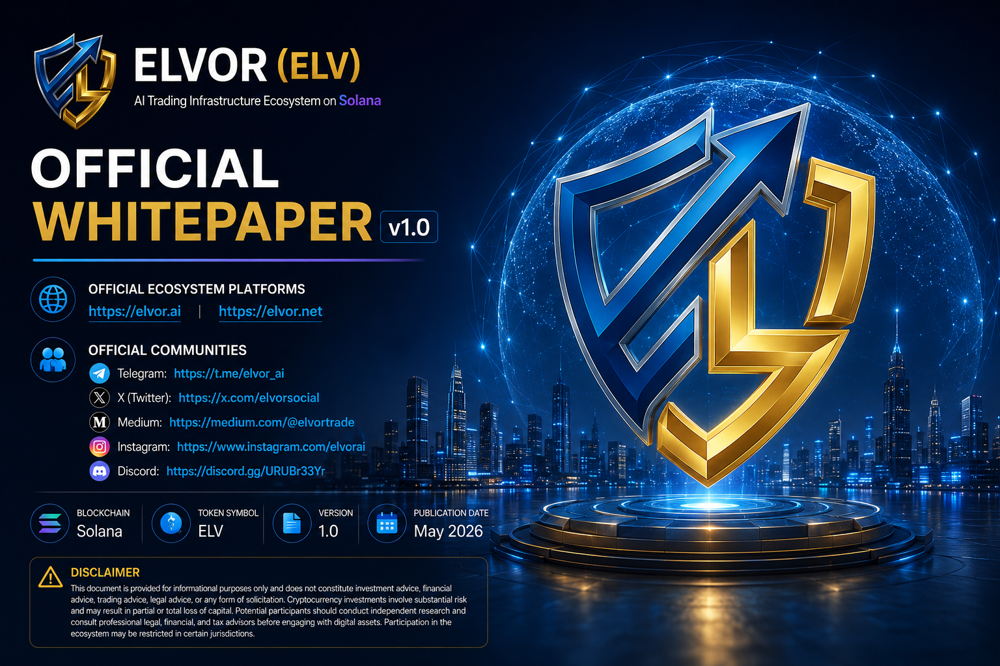

---

# DISCLAIMER

This document is provided for informational purposes only and does not constitute investment advice, financial advice, trading advice, legal advice, or any form of solicitation.

The ELV token is designed as a utility token intended for ecosystem participation, AI infrastructure access, trading benefits, staking mechanisms, governance systems, and platform interaction.

Cryptocurrency investments involve substantial risk and may result in partial or total loss of capital.

Security reviews, audit references, public contract visibility, and vesting transparency may reduce risk but do not guarantee that ELV or any digital asset is risk-free.

Potential participants should conduct independent research and consult professional legal, financial, and tax advisors before engaging with digital assets.

Participation in the ecosystem may be restricted in certain jurisdictions.

---

# TABLE OF CONTENTS

1. Executive Summary  
2. Vision & Mission  
3. Industry Overview  
4. Problems in Existing Trading Infrastructure  
5. The Elvor Ecosystem  
6. Elvor AI Trading Platform  
7. Elvor Exchange Infrastructure  
8. NFT Marketplace & Social Trading  
9. Mobile Super App & Mini Apps  
10. ELV Token Overview  
11. Tokenomics  
12. Staking & Governance  
13. Revenue Model  
14. Security & Infrastructure  
15. Roadmap  
16. Marketing & Expansion Strategy  
17. Legal & Compliance  
18. Long-Term Vision  
19. Conclusion  
20. Official Links & Ecosystem Directory  

---

# PAGE 1 — EXECUTIVE SUMMARY

Elvor is a next-generation AI-powered trading infrastructure ecosystem designed to merge artificial intelligence, exchange technology, social trading, portfolio intelligence, automation systems, institutional-grade analytics, and blockchain scalability into a unified platform.

The ecosystem operates through multiple interconnected platforms and products.

## Core Platforms

### Elvor AI
https://elvor.ai

AI-powered trading infrastructure including:
- AI trading assistant
- AI market analysis
- AI-generated signals
- Portfolio intelligence
- Smart automation
- AI strategy systems
- Risk analysis systems
- AI trading copilots

---

### Elvor Exchange
https://elvor.net

A premium exchange ecosystem providing:
- Spot trading
- Futures trading
- Cross-chain trading
- Liquidity systems
- Institutional APIs
- High-speed execution
- Advanced order management
- Professional trading interfaces

---

### Elvor Staking
https://elvor.net/staking

The official staking interface for ELV ecosystem participants.

---

### Additional Ecosystem Infrastructure

Elvor additionally includes:
- AI bot marketplace
- NFT marketplace
- Mobile super app
- Social trading infrastructure
- AI hedge systems
- On-chain analytics
- Cross-chain integrations
- Trading mini-app systems
- Institutional analytics
- Community governance

---

# ELV TOKEN

The native utility token of the Elvor ecosystem built on Solana.

ELV is designed to function as:
- Utility asset
- Governance asset
- Access asset
- Trading incentive asset
- Ecosystem participation asset
- AI infrastructure access token

---

# Ecosystem Architecture Visual

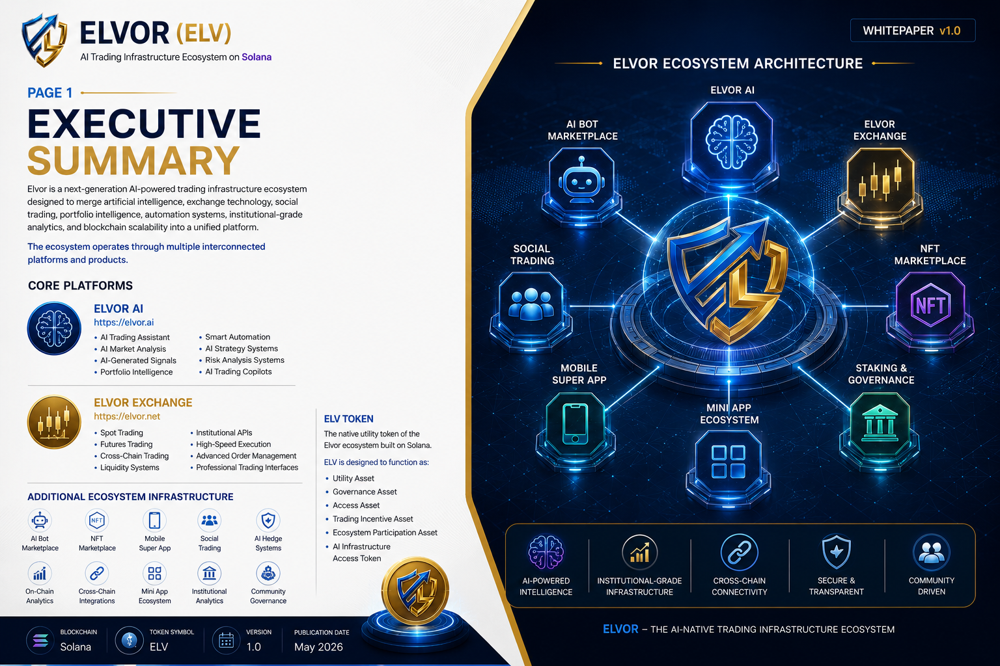

---

# PAGE 2 — VISION & MISSION

# Vision

To become the leading AI-native financial trading ecosystem globally by integrating:
- Artificial intelligence
- Institutional trading infrastructure
- Smart automation
- Blockchain scalability
- Social trading systems
- Decentralized governance
- Cross-chain liquidity

Into one intelligent financial ecosystem.

---

# Mission

Elvor aims to democratize institutional-grade trading technology and AI-powered financial intelligence for retail users, professional traders, institutions, and global communities.

---

# Core Principles

## Technology First
Real infrastructure before speculation.

## Sustainable Growth
Long-term ecosystem expansion over short-term hype.

## Utility-Based Economics
Real token utility powering ecosystem demand.

## Institutional Quality
Professional-grade infrastructure accessible globally.

## Community Ownership
Progressive decentralization and governance participation.

---

# Vision & Governance Visual

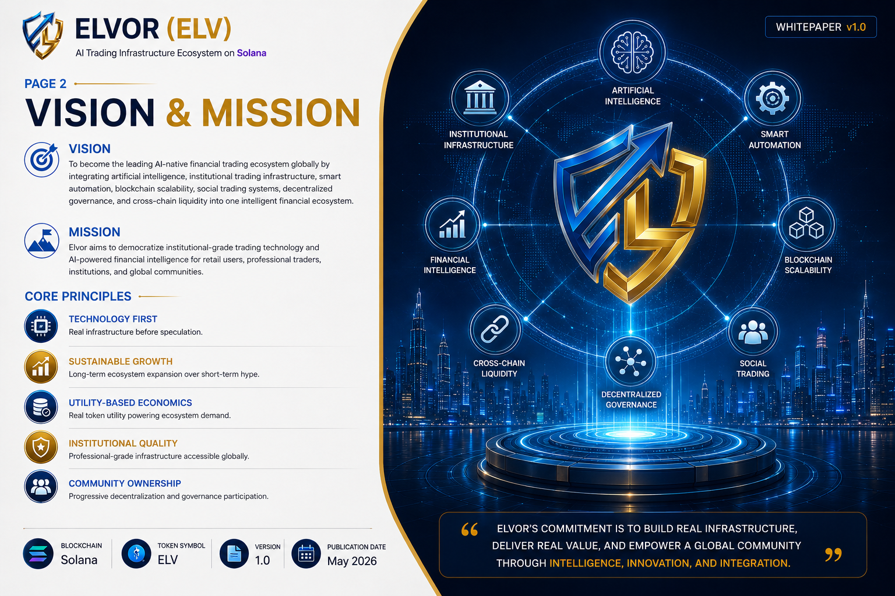

---

# PAGE 3 — INDUSTRY OVERVIEW

The cryptocurrency industry has evolved into one of the largest emerging financial sectors globally.

Key growth sectors include:
- AI-driven trading systems
- Decentralized finance
- Exchange infrastructure
- Institutional crypto adoption
- Automated trading
- Cross-chain liquidity
- Social trading
- On-chain analytics

---

# AI & Trading Convergence

Traditional trading systems rely heavily on:
- manual analysis
- emotional decision-making
- fragmented tools
- delayed reactions

AI-driven infrastructure enables:
- real-time analysis
- predictive intelligence
- automated risk management
- multi-market scanning
- intelligent execution systems

---

# Market Opportunity

The AI trading market is expected to experience substantial long-term expansion due to:
- increasing crypto adoption
- institutional participation
- demand for automation
- demand for analytics
- global digital finance growth

---

# Industry Growth Visual

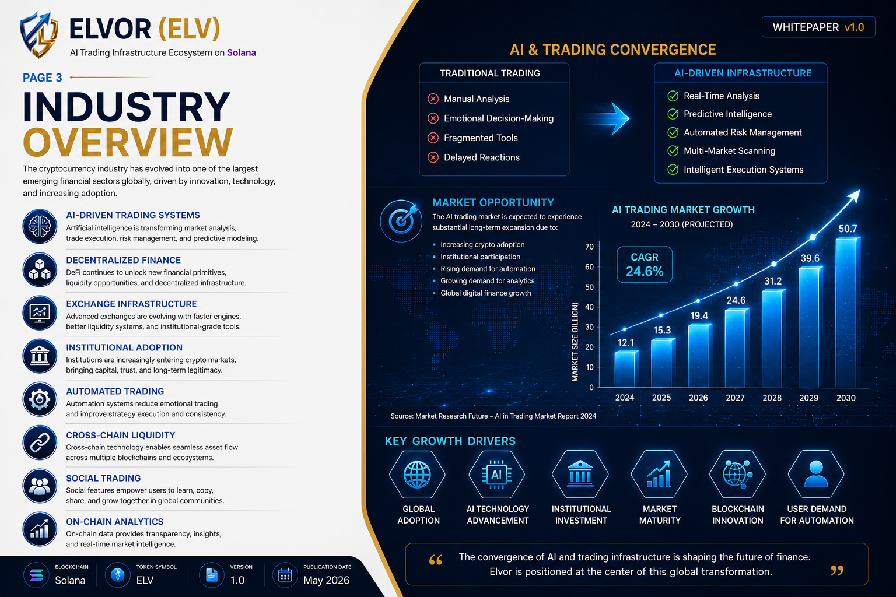

---

# PAGE 4 — PROBLEMS IN EXISTING TRADING INFRASTRUCTURE

Despite industry growth, major problems still exist.

# Fragmented User Experience

Users often require multiple platforms for:
- trading
- AI analysis
- signals
- portfolio tracking
- copy trading
- analytics
- NFTs
- automation systems

---

# Poor Signal Quality

Most signal providers:
- lack transparency
- offer inconsistent results
- lack AI intelligence
- provide no risk analysis

---

# High Trading Complexity

Institutional tools remain inaccessible for most users.

---

# Limited Automation

Most exchanges still operate without:
- AI copilots
- automated intelligence
- portfolio automation
- adaptive market analysis

---

# Cross-Chain Complexity

Managing multiple chains remains difficult for most users.

---

# Security Risks

Many platforms lack:
- institutional security
- transparent systems
- professional risk monitoring

---

# Elvor Solution

Elvor integrates all major trading infrastructure layers into one ecosystem.

---

# Infrastructure Comparison Visual

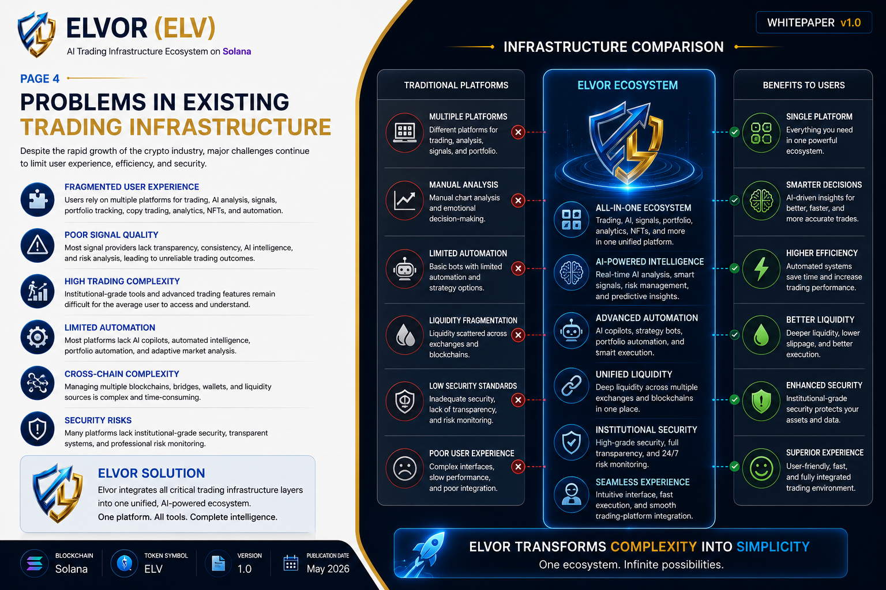

---

# PAGE 5 — THE ELVOR ECOSYSTEM

# Unified AI Trading Infrastructure

The Elvor ecosystem combines multiple financial technologies into one interconnected platform.

---

# Core Ecosystem Components

## 1. Elvor AI Platform
https://elvor.ai

## 2. Elvor Exchange
https://elvor.net

## 3. Elvor Staking
https://elvor.net/staking

## 4. Mobile Super App

## 5. NFT Marketplace

## 6. AI Bot Marketplace

## 7. Social Trading Systems

## 8. Mini App Ecosystem

---

# Ecosystem Infographic

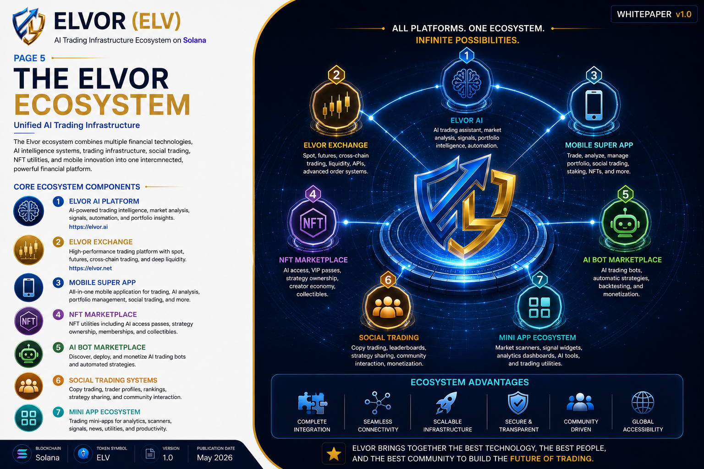

---

# PAGE 6 — ELVOR AI TRADING PLATFORM

# Artificial Intelligence Infrastructure

The Elvor AI platform forms the intelligence layer of the ecosystem.

---

# AI Trading Assistant

Capabilities include:
- trade analysis
- entry suggestions
- risk management
- portfolio insights
- AI-generated explanations
- multi-market scanning
- technical analysis
- behavioral analysis

---

# AI Signal Engine

Machine learning systems process:
- technical indicators
- market volatility
- liquidity conditions
- sentiment analysis
- on-chain data
- order flow
- macroeconomic conditions

---

# AI Hedge Systems

Institutional-grade AI hedge infrastructure.

---

# AI Portfolio Intelligence

Portfolio systems provide:
- asset allocation insights
- diversification analysis
- behavioral analytics
- intelligent notifications

---

# AI Dashboard Visual

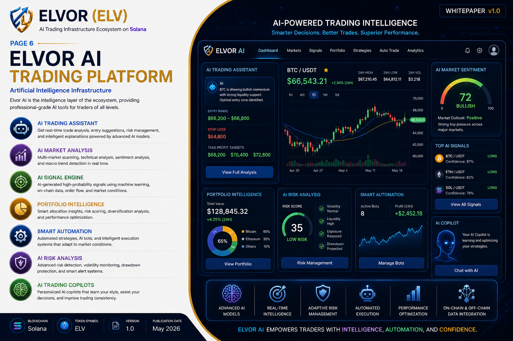

---

# PAGE 7 — ELVOR EXCHANGE INFRASTRUCTURE

# Institutional Exchange Technology

Elvor Exchange is designed as a premium trading infrastructure platform.

---

# Core Exchange Features

## Spot Trading

## Futures Trading

## Cross-Chain Trading

## Institutional APIs

## Advanced Order Systems

---

# Liquidity Infrastructure

Professional liquidity management and scalable execution engines.

---

# Security Architecture

Infrastructure includes:
- cold wallet systems
- risk monitoring
- anomaly detection
- multi-signature treasury

---

# Exchange Interface Visual

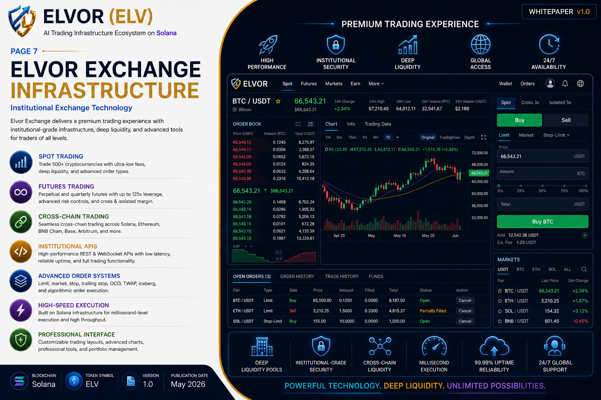

---

# PAGE 8 — NFT MARKETPLACE & SOCIAL TRADING

# NFT Marketplace

Potential NFT utilities include:
- AI access passes
- VIP memberships
- strategy ownership
- creator economies
- ecosystem collectibles

---

# Social Trading Infrastructure

Features include:
- copy trading
- trader rankings
- strategy monetization
- community intelligence

---

# Social Trading Visual

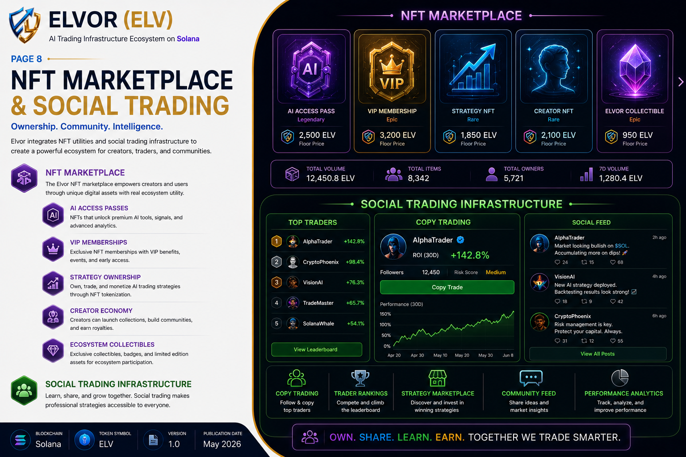

---

# PAGE 9 — MOBILE SUPER APP & MINI APPS

# Mobile Super App

Capabilities include:
- trading
- AI analysis
- portfolio management
- copy trading
- staking
- analytics
- NFT management
- social interaction

---

# Mini App Ecosystem

Mini app examples:
- market scanners
- signal widgets
- analytics dashboards
- AI assistants
- strategy modules

---

# Mobile Super App Visual

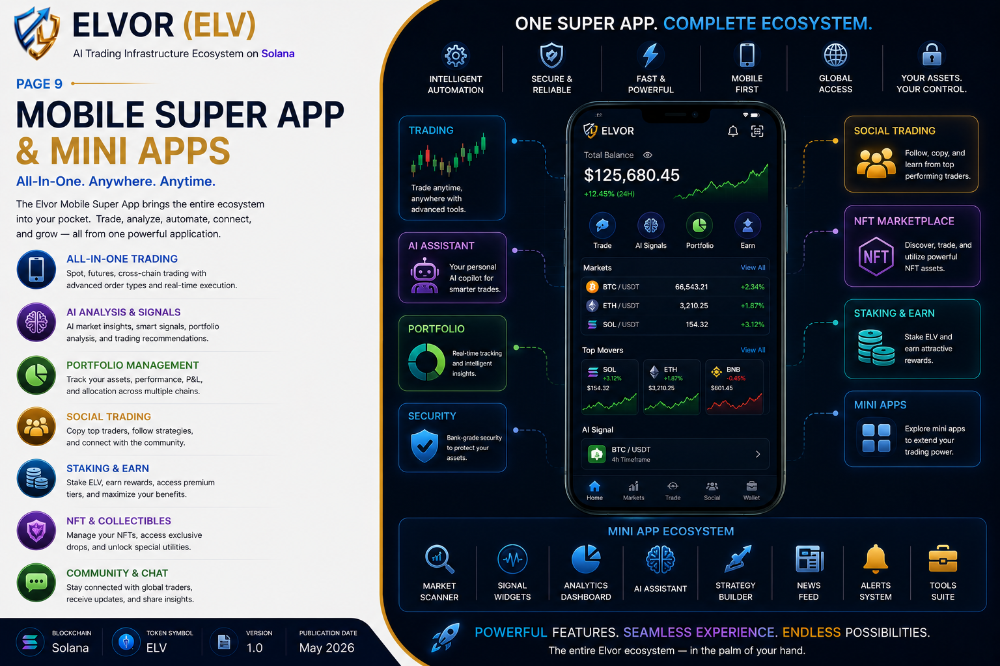

---

# PAGE 10 — ELV TOKEN OVERVIEW

# ELV Token

## Token Name
Elvor

## Symbol
ELV

## Blockchain
Solana

## Token Type
Utility & Governance

## Contract Address
[7QGnYbxU79rTcQt5TqF6y4R5XLcsSBnRtfjdnj8AtkqL](https://solscan.io/token/7QGnYbxU79rTcQt5TqF6y4R5XLcsSBnRtfjdnj8AtkqL)

## Total Supply
10,000,000,000 ELV

---

# Core Utility

ELV powers:
- AI access
- exchange utility
- staking systems
- governance participation
- fee reduction
- premium subscriptions
- liquidity incentives
- ecosystem participation

---

# Security & Transparency References

| Token / Security Page | Link |
|---|---|
| ELV Contract Address | [7QGnYbxU79rTcQt5TqF6y4R5XLcsSBnRtfjdnj8AtkqL](https://solscan.io/token/7QGnYbxU79rTcQt5TqF6y4R5XLcsSBnRtfjdnj8AtkqL) |
| Solscan Token Info | [View ELV on Solscan](https://solscan.io/token/7QGnYbxU79rTcQt5TqF6y4R5XLcsSBnRtfjdnj8AtkqL) |
| Cyberscope Cyberscan | [Scan ELV on Cyberscope](https://www.cyberscope.io/cyberscan?network=SOL&address=7QGnYbxU79rTcQt5TqF6y4R5XLcsSBnRtfjdnj8AtkqL) |
| GoPlus Solana Token Security | [Scan ELV on GoPlus](https://gopluslabs.io/en/token-security/solana/7QGnYbxU79rTcQt5TqF6y4R5XLcsSBnRtfjdnj8AtkqL) |
| DexScreener Token Page | [View ELV on DexScreener](https://dexscreener.com/solana/7QGnYbxU79rTcQt5TqF6y4R5XLcsSBnRtfjdnj8AtkqL) |
| Birdeye Token Page | [View ELV on Birdeye](https://birdeye.so/token/7QGnYbxU79rTcQt5TqF6y4R5XLcsSBnRtfjdnj8AtkqL?chain=solana) |
| Jupiter Token Page | [View ELV on Jupiter](https://jup.ag/tokens/7QGnYbxU79rTcQt5TqF6y4R5XLcsSBnRtfjdnj8AtkqL) |
| Streamflow Vesting Transparency | [View Streamflow App](https://app.streamflow.finance) |

Security reviews and transparency references are intended to support trust, public verification, and risk reduction. They do not eliminate all risks.

---

# Token Utility Visual

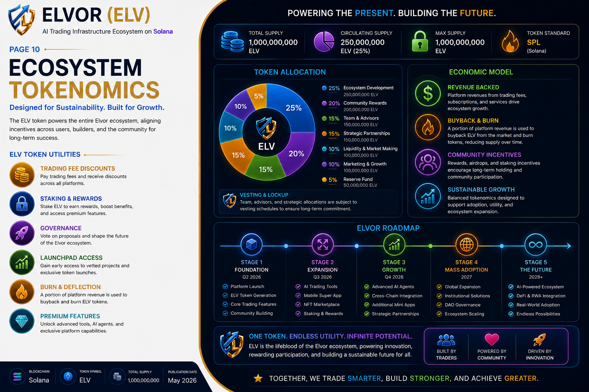

---

# PAGE 11 — TOKENOMICS

# Total Supply
10,000,000,000 ELV

---

# Token Allocation & Streamflow Distribution

| Allocation | % | Tokens | Wallet | Streamflow / Platform Link |
|---|---:|---:|---|---|
| Ecosystem Rewards | 22% | 2,200,000,000 ELV | [7LowjVDtmNWkVJ6oKesr6HnbG3k62rVvLZGk3gdXZZd1](https://solscan.io/account/7LowjVDtmNWkVJ6oKesr6HnbG3k62rVvLZGk3gdXZZd1) | [J9NcQNpaag6aj2iMo9HJ7ZA3CWQ3AtSWX8qWYdjEVjxE](https://app.streamflow.finance/contract/solana/mainnet/J9NcQNpaag6aj2iMo9HJ7ZA3CWQ3AtSWX8qWYdjEVjxE) |
| AI & Trading Incentives | 18% | 1,800,000,000 ELV | [BNLR71qUaXy1zixxThwGTj9EupUkRYYPQiLetVDzLJvZ](https://solscan.io/account/BNLR71qUaXy1zixxThwGTj9EupUkRYYPQiLetVDzLJvZ) | [AT4Du46rfvesHumowxocGcjymqECRL4mycPueaJFwEsj](https://app.streamflow.finance/contract/solana/mainnet/AT4Du46rfvesHumowxocGcjymqECRL4mycPueaJFwEsj) |
| Treasury Reserve | 15% | 1,500,000,000 ELV | [YTGrUtcvstu7NQRmFLHRe72FZRJPz4UgFGNa9kpu76d](https://solscan.io/account/YTGrUtcvstu7NQRmFLHRe72FZRJPz4UgFGNa9kpu76d) | [FHTbWwHh9LKWyTYtvmz6V7RHWRCpSBemDzm3BxVnU5i](https://app.streamflow.finance/contract/solana/mainnet/FHTbWwHh9LKWyTYtvmz6V7RHWRCpSBemDzm3BxVnU5i) |
| Liquidity & Market Making | 12% | 1,200,000,000 ELV | [28BhGstCCdHyC9FQzXEUfcjh8ukpnX73BjC8LVtntEgF](https://solscan.io/account/28BhGstCCdHyC9FQzXEUfcjh8ukpnX73BjC8LVtntEgF) | [9bLgzaq3a2djLgjKVtJ2gxmMunpbDALM5py4KwNygHQ4](https://app.streamflow.finance/contract/solana/mainnet/9bLgzaq3a2djLgjKVtJ2gxmMunpbDALM5py4KwNygHQ4) |
| Team & Contributors | 10% | 1,000,000,000 ELV | [2uwQ5rS2AdmJn9Cw35GkrB9hMk9SZj7iipqqxsqEJhXj](https://solscan.io/account/2uwQ5rS2AdmJn9Cw35GkrB9hMk9SZj7iipqqxsqEJhXj) | [HuaTvAHhCVsbeD5QKrNq7TaUAqZWCtcVnvvVzFF3WsCH](https://app.streamflow.finance/contract/solana/mainnet/HuaTvAHhCVsbeD5QKrNq7TaUAqZWCtcVnvvVzFF3WsCH) |
| Strategic Investors | 8% | 800,000,000 ELV | [AjWSDMkFW4cnQuMNMBA83t6ZVLUzHpUWQvV5a6jZJB3R](https://solscan.io/account/AjWSDMkFW4cnQuMNMBA83t6ZVLUzHpUWQvV5a6jZJB3R) | [2cwQo4hBXDbX9AZF8dHdLxhrFAF33kpUeZyi63aSCEJ7](https://app.streamflow.finance/contract/solana/mainnet/2cwQo4hBXDbX9AZF8dHdLxhrFAF33kpUeZyi63aSCEJ7) |
| Marketing & Partnerships | 7% | 700,000,000 ELV | [7P6NgN3AyEyB66ZcGSCd8Zyt13RdkExpPDMfw5Xdsdd1](https://solscan.io/account/7P6NgN3AyEyB66ZcGSCd8Zyt13RdkExpPDMfw5Xdsdd1) | [3Wr4xyX1uXTtECKthaJBCAmnLDororJe18mMatTAsxsU](https://app.streamflow.finance/contract/solana/mainnet/3Wr4xyX1uXTtECKthaJBCAmnLDororJe18mMatTAsxsU) |
| Staking Rewards | 5% | 500,000,000 ELV | [A26sPCUs2rwu5gBhAfGg27KqvUz6V2Z8UTNwumHSHKHm](https://solscan.io/account/A26sPCUs2rwu5gBhAfGg27KqvUz6V2Z8UTNwumHSHKHm) | [https://elvor.net/staking](https://elvor.net/staking) |
| Public Sale | 2% | 200,000,000 ELV | [E7E2Ex4od6FTHSBSNM4GMVdvH4koiX8TtkeBVJHgwfSg](https://solscan.io/account/E7E2Ex4od6FTHSBSNM4GMVdvH4koiX8TtkeBVJHgwfSg) | [https://elvor.net](https://elvor.net) |
| Community Airdrop | 1% | 100,000,000 ELV | [3b9SNhT14ijZeXGtijZezA3otHrZjyPwT6ZN7v6eHXxN](https://solscan.io/account/3b9SNhT14ijZeXGtijZezA3otHrZjyPwT6ZN7v6eHXxN) | [https://elvor.net](https://elvor.net) |

---

# Streamflow Distribution Schedule

| Allocation | Product | TGE Unlock | Release Schedule | Duration |
|---|---|---:|---|---|
| Ecosystem Rewards | Vesting | 0 ELV | Quarterly | 48 Months |
| AI & Trading Incentives | Vesting | 90,000,000 ELV | Monthly | 36 Months |
| Treasury Reserve | Token Lock / Vesting | 0 ELV | Quarterly | 48 Months |
| Liquidity & Market Making | Vesting | 300,000,000 ELV | Monthly | 12 Months |
| Team & Contributors | Vesting | 0 ELV | Quarterly | 36 Months |
| Strategic Investors | Vesting | 0 ELV | Quarterly | 18 Months |
| Marketing & Partnerships | Vesting | 35,000,000 ELV | Monthly | 24 Months |
| Staking Rewards | Staking Rewards Pool | 0 ELV | Controlled Rewards | 48 Months |
| Public Sale | Vesting / Claim | 50,000,000 ELV | Monthly | 6 Months |
| Community Airdrop | Vested Airdrop | 20,000,000 ELV | Monthly | 12 Months |

---

# Tokenomics Visual

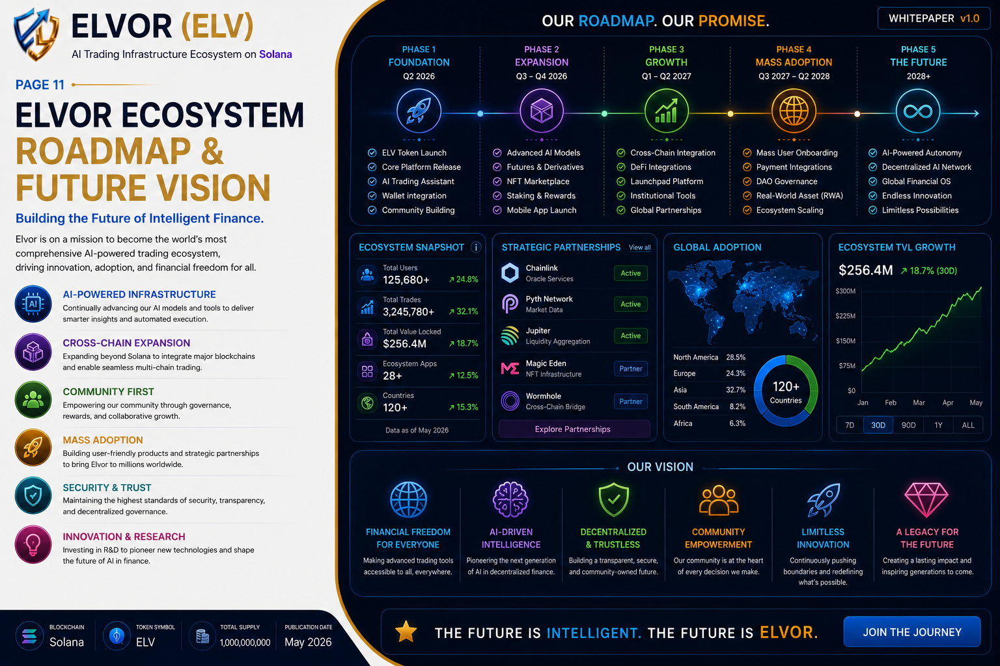

---

# PAGE 12 — STAKING & GOVERNANCE

# ELV Staking Infrastructure

Staking enables:
- passive rewards
- governance participation
- AI access tiers
- fee reduction
- premium ecosystem benefits

---

# Official Staking Platform

https://elvor.net/staking

---

# Staking Rewards Wallet

[A26sPCUs2rwu5gBhAfGg27KqvUz6V2Z8UTNwumHSHKHm](https://solscan.io/account/A26sPCUs2rwu5gBhAfGg27KqvUz6V2Z8UTNwumHSHKHm)

---

# Governance System

ELV holders may participate in governance proposals.

---

# Governance Visual

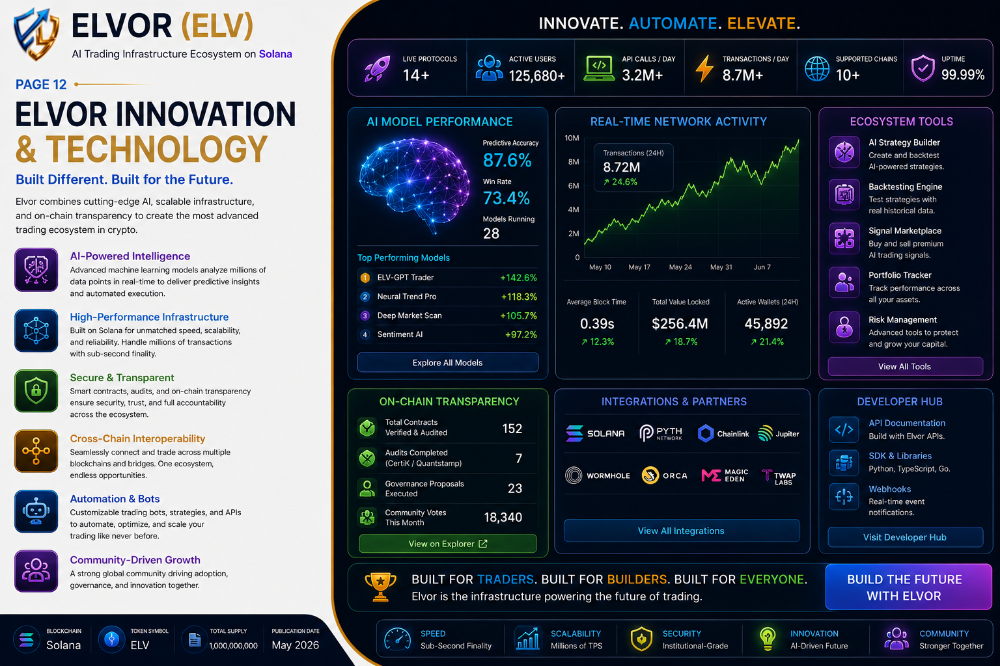

---

# PAGE 13 — REVENUE MODEL

# Ecosystem Revenue Sources

Generated through:
- exchange fees
- AI subscriptions
- social trading
- NFT marketplace
- bot marketplace

---

# Revenue Model Visual

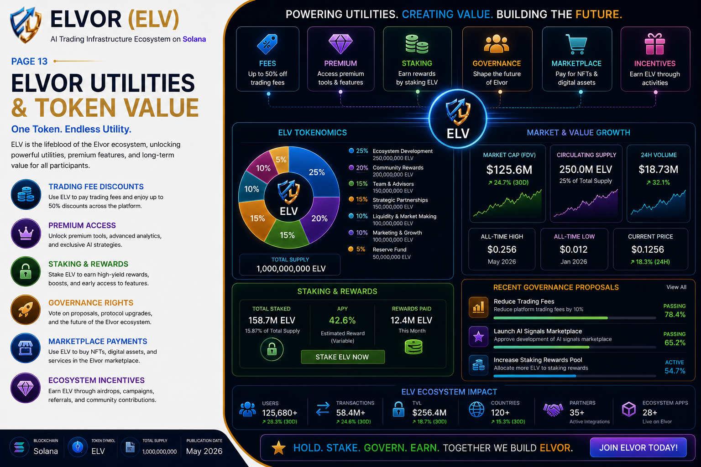

---

# PAGE 14 — SECURITY & INFRASTRUCTURE

# Security Philosophy

Security is a foundational priority within the Elvor ecosystem.

---

# Smart Contract Security

ELVOR prioritizes contract transparency and external security review references, including:

| Token / Security Page | Link |
|---|---|
| ELV Contract Address | [7QGnYbxU79rTcQt5TqF6y4R5XLcsSBnRtfjdnj8AtkqL](https://solscan.io/token/7QGnYbxU79rTcQt5TqF6y4R5XLcsSBnRtfjdnj8AtkqL) |
| Solscan Token Info | [View ELV on Solscan](https://solscan.io/token/7QGnYbxU79rTcQt5TqF6y4R5XLcsSBnRtfjdnj8AtkqL) |
| Cyberscope Cyberscan | [Scan ELV on Cyberscope](https://www.cyberscope.io/cyberscan?network=SOL&address=7QGnYbxU79rTcQt5TqF6y4R5XLcsSBnRtfjdnj8AtkqL) |
| GoPlus Solana Token Security | [Scan ELV on GoPlus](https://gopluslabs.io/en/token-security/solana/7QGnYbxU79rTcQt5TqF6y4R5XLcsSBnRtfjdnj8AtkqL) |
| DexScreener Token Page | [View ELV on DexScreener](https://dexscreener.com/solana/7QGnYbxU79rTcQt5TqF6y4R5XLcsSBnRtfjdnj8AtkqL) |
| Birdeye Token Page | [View ELV on Birdeye](https://birdeye.so/token/7QGnYbxU79rTcQt5TqF6y4R5XLcsSBnRtfjdnj8AtkqL?chain=solana) |
| Jupiter Token Page | [View ELV on Jupiter](https://jup.ag/tokens/7QGnYbxU79rTcQt5TqF6y4R5XLcsSBnRtfjdnj8AtkqL) |
| Streamflow Vesting Transparency | [View Streamflow App](https://app.streamflow.finance) |

All contracts and infrastructure should undergo:
- professional audits
- penetration testing
- infrastructure review
- token distribution transparency review
- continuous monitoring where applicable

---

# Infrastructure Security

Includes:
- cold storage systems
- multi-signature wallets
- anomaly monitoring
- infrastructure redundancy

---

# Streamflow Transparency

ELVOR uses Streamflow on Solana for:
- token vesting
- treasury locks
- staking rewards
- public unlock transparency
- community distribution infrastructure

All Streamflow contracts are publicly visible.

---

# Security Infrastructure Visual

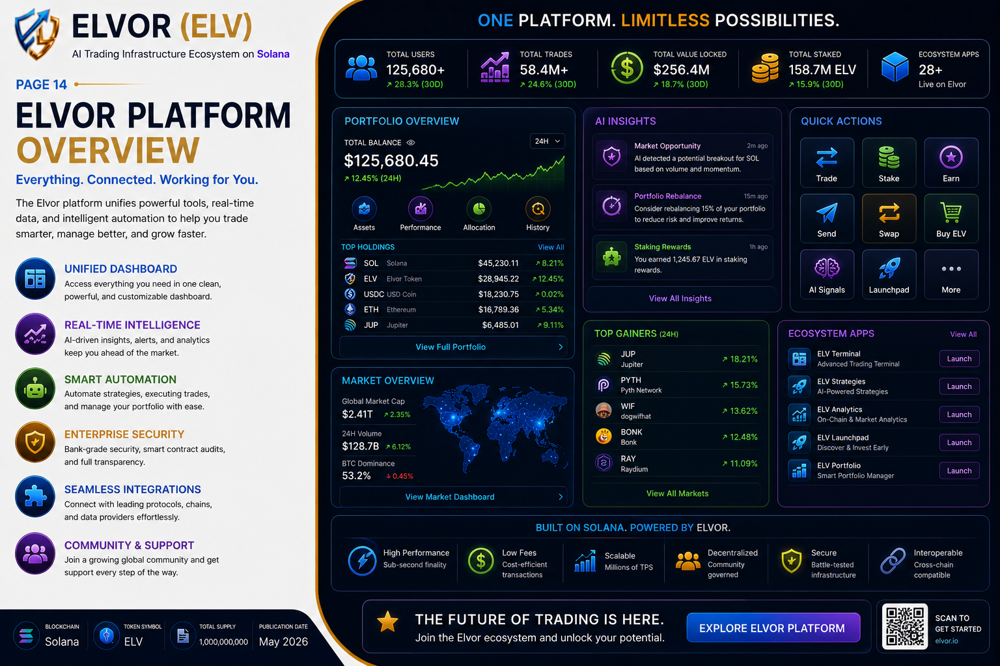

---

# PAGE 15 — ROADMAP

# Phase 1 — Foundation

- brand development
- AI infrastructure development
- exchange architecture
- community expansion
- Streamflow vesting deployment
- token security infrastructure

---

# Phase 2 — Platform Expansion

- AI assistant deployment
- exchange beta systems
- mobile app infrastructure
- social trading deployment
- initial staking systems
- Raydium liquidity launch

---

# Phase 3 — ELV Launch

- token generation event
- liquidity deployment
- Jupiter integrations
- public sale
- airdrop campaign launch
- staking launch
- governance activation

---

# Phase 4 — Ecosystem Scaling

- institutional APIs
- cross-chain integrations
- AI marketplace expansion
- NFT marketplace deployment
- copy trading infrastructure
- strategy monetization

---

# Phase 5 — Global Expansion

- global partnerships
- institutional onboarding
- AI hedge infrastructure
- multi-chain expansion
- DAO governance
- global liquidity systems

---

# Roadmap Visual

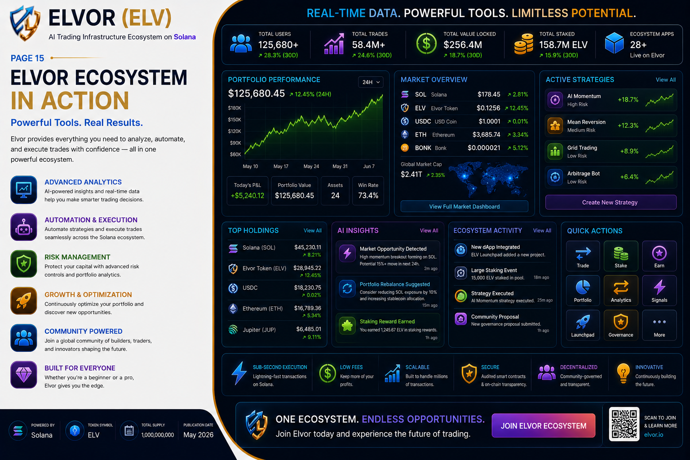

---

# PAGE 16 — MARKETING & EXPANSION STRATEGY

# Community-Centered Growth

Primary growth channels:
- Telegram
- X (Twitter)
- Discord
- Medium
- Instagram
- Influencer partnerships
- Trading communities

---

# Brand Positioning

Elvor is positioned as:

# “AI Trading Infrastructure Ecosystem”

---

# Strategic Advantages

Elvor combines:
- AI systems
- exchange infrastructure
- social trading
- cross-chain architecture
- mobile super app
- NFT marketplace

Inside one ecosystem.

---

# Global Expansion Visual

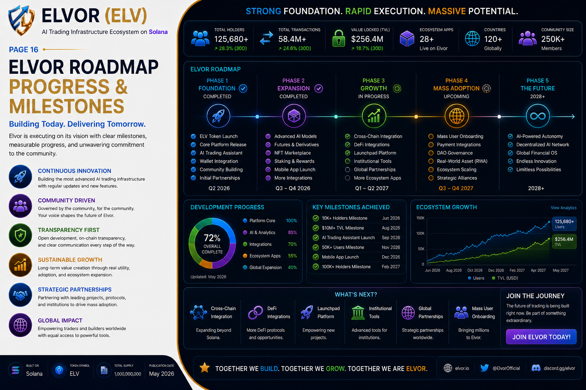

---

# PAGE 17 — LEGAL & COMPLIANCE

# Compliance Considerations

Potential frameworks include:
- AML systems
- KYC procedures
- jurisdictional analysis
- operational compliance

---

# Legal Infrastructure

Professional legal consultation remains a strategic priority.

---

# Compliance Visual

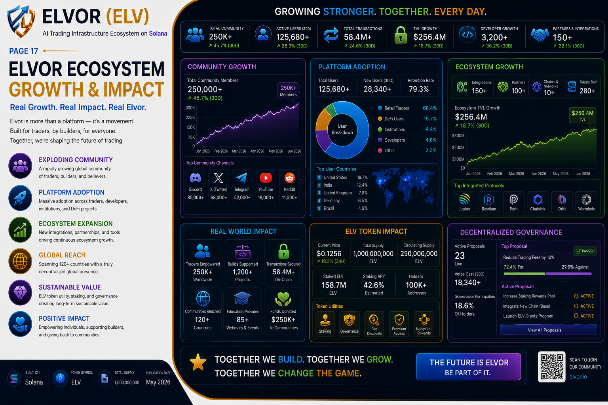

---

# PAGE 18 — LONG-TERM VISION

# Long-Term Objectives

## AI Financial Intelligence

## Multi-Chain Infrastructure

Expansion across:
- Solana
- Ethereum
- BNB Chain
- Base
- Arbitrum

---

## Institutional Expansion

Serving:
- funds
- quantitative traders
- enterprises
- professional trading firms

---

# Long-Term Vision Visual

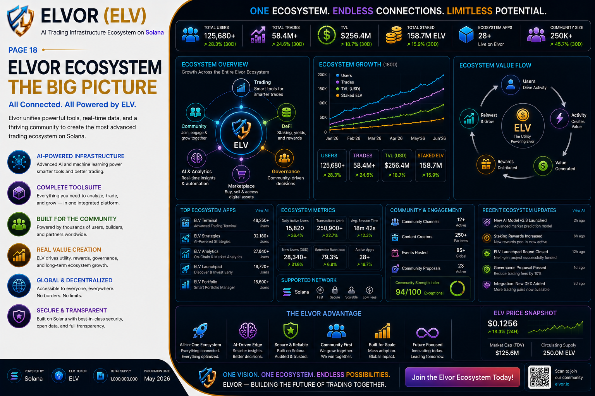

---

# PAGE 19 — CONCLUSION

Elvor combines:
- artificial intelligence
- exchange infrastructure
- institutional trading systems
- social trading
- NFT ecosystems
- mobile super apps
- cross-chain infrastructure
- AI automation

Into one unified ecosystem.

---

# Final Statement

The future of trading infrastructure will be driven by:
- intelligence
- automation
- scalability
- interoperability
- community participation

Elvor is designed to operate at the center of this transformation.

---

# PAGE 20 — OFFICIAL LINKS & ECOSYSTEM DIRECTORY

# Official Platforms

## Elvor AI
https://elvor.ai

## Elvor Exchange
https://elvor.net

## Elvor Staking
https://elvor.net/staking

## ELV Contract
[7QGnYbxU79rTcQt5TqF6y4R5XLcsSBnRtfjdnj8AtkqL](https://solscan.io/token/7QGnYbxU79rTcQt5TqF6y4R5XLcsSBnRtfjdnj8AtkqL)

---

# Official Communities

## Telegram
https://t.me/elvor_ai

## X (Twitter)
https://x.com/elvorsocial

## Medium
https://medium.com/@elvortrade

## Instagram
https://www.instagram.com/elvorai

## Discord
https://discord.gg/URUBr33Yr

---

# Final Cinematic Artwork

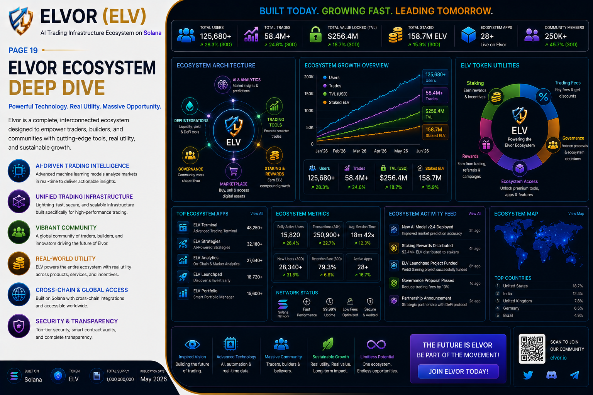

---

# FINAL NOTE

The strongest advantage of Elvor is not simply the token.

It is the combination of:
- real infrastructure
- AI systems
- exchange technology
- social trading
- ecosystem integration
- mobile accessibility
- institutional scalability

This positioning should remain central in all branding, marketing, exchange listings, partnership discussions, and investor communications.
